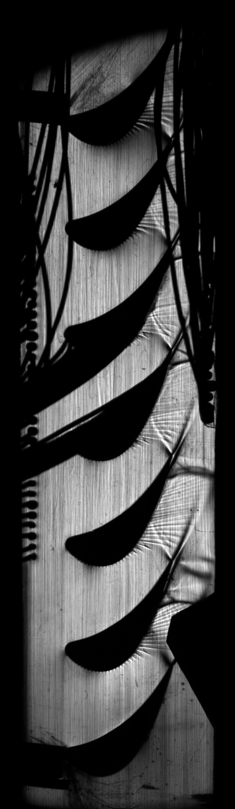
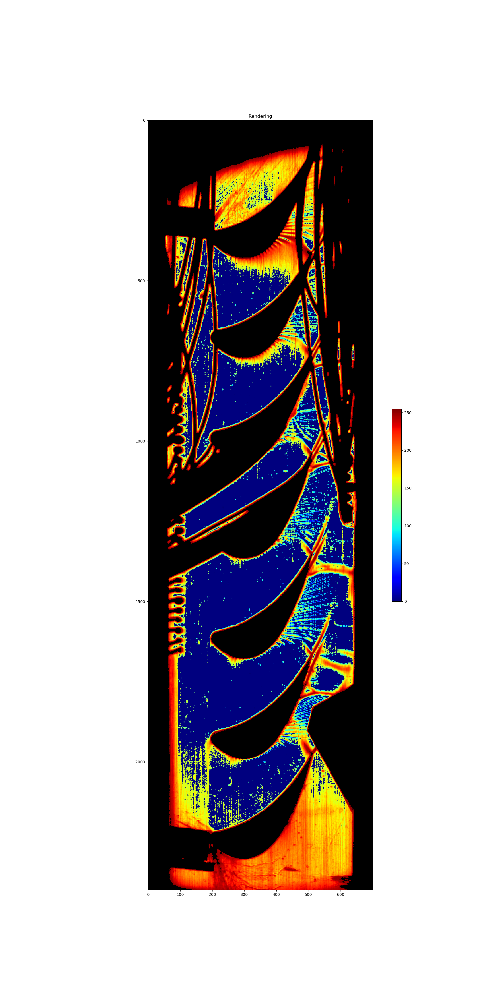

# ReadMe

整个图像一共可以分为三大部分
- rigid rigion
    
    比如管道和试件，管壁等区域
- flow

    重点需要统计的区域
    
- background with noise

   亮色管壁， 并且伴随这条纹噪声.

由于对结果的灰度值要求很高， 所以这里采用分割思想处理问题： 将flow从
图像中分割出来， 然后通过式子得到图像

result = src × mask_flow

如何得到一个尽可能好的mask_flow 就是重点所在

### Rigid Rigion

此mask将区域分rigid and norigid
 
R: rigid region
 
\bar{R} background , flow

经过试验， 可以得到通过 rigid_M = [src < delta] 就可以简单得到rigid rigion mask, delta in [2,5]
 也易得到 flow_bkg_M = !rigid_M
### Flow Rigion

background and flow是最难区分的 特别是在激波附近的背景。 

另外bkg上掺杂着 具有垂直方向竖条纹特征的噪声， 这严重影响了激波的提取， 幸运的是激波是横向条纹， 通过此我们可以下手。

我们通过两个特殊的卷积核“south， north”， 对src图像进行卷积， 得到纵向纹理抑制，横向纹理加深的两个图像img_n, img_s.
横向纹理的灰度在两图中分别被放大或减小， 以此来讲其与纵向纹理区分。此时再用截断操作即可得到气流mask， flow_M

### Back Ground Rigion
通过 上述得到的 flow_bkg_M 与flow_M j进行与操作即可得到背景mask,bkg_M.

### Rendering

对bkg置零，并和flow一起进行color map = ’jet‘渲染， 另外对rigid区域进行’bone‘渲染得到最终图像

### Results

    