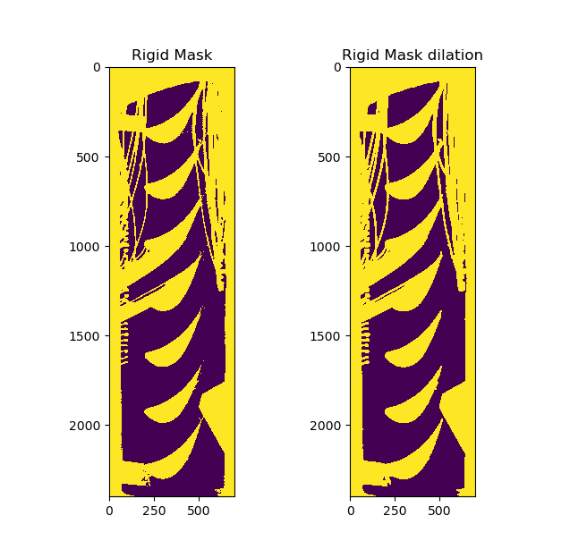

# Schlieren


整个图像一共可以分为三大部分
- rigid

    比如管道和试件，管壁等区域
- flow

    重点需要统计的区域

- bkg (background)

   亮色管壁， 并且伴随这条纹噪声.

由于对结果的灰度值要求很高， 所以这里采用分割思想处理问题

```latex
  I_{dst} = I_{src} × M_{dst}, dst \in { flow,rigid,bkg }

```


### Rigid Region

M_r 将区域分 rigid and no-rigid

```
I_{rigid} = I_{src} x M_{rigid}

```

经过试验， 可以得到通过
```
 M_{rigid} = [I_{src} < \delta], \delta \in [2,5] %\delta即为rigid bound
```
 就可以简单得到M_r， 也易知
```
M_{flow} + M_{bkg} = !M_{rigid}

```
另外， 由于 rigid region 边界像素会渐变， 简单通过边界分割会使得该区域缺失， 造成最后渲染出现红线的情况，这种情况可以通过该区域形态学膨胀解决。

### Flow Rigion

I_{flow} I_{bkg} 是最难区分的 特别是在激波附近的背景。

而且I_{bkg}上掺杂着 具有垂直方向竖条纹特征的噪声， 这严重影响了激波的提取.

这里观察到激波是横向条纹， 通过此可以下手。

我们通过两个特殊的卷积核“K_s， K_n”， 对src图像进行卷积， 得到纵向纹理抑制，横向纹理加深的两个图像

```
K_s = [-1, -2, -1,
          0, 1, 0,
          1, 2, 1]
K_n = [1, 2, 1,
      0, 1, 0,
      -1, -2, -1]

\hat{I}_s = I_{src} * K_s

\hat{I}_n = I_{src} * K_n

```

这里 * 为卷积操作。

横向纹理的灰度在两图中分别被放大或减小， 以此来讲其与纵向纹理区分。此时再用截断操作即可得到

```
 M_{flow}  = [\hat{I}_s < \delta_1] \cdot [\hat{I}_n<\delta_1 ] \cdot (1 - M_{rigid})


```
### Back Ground Rigion
通过 上述得到的 mask 进行如下则可得到 M_{bkg}

```
 M_{bkg} 1- M_{rigid} - M_{flow}
```

### M_rigid 修正

由于简单通过截断操作会有噪点， 并且在边界会出现部分误差， 所以对 M_{rigid} 通过图像腐蚀-膨胀操作，进行简单处理， 去除小坨噪点，并稍微延伸边界。
```
M_{rigid} = cv2.dilate(cv2.erode(M_{rigid}))
```


通过该操作能将小块噪声去除， 并将rigid区域边缘圆滑扩张

### Rendering

通过上面求解， 我们可以将图像分为三个区域

```
I_{rigid} = I_{src} * M_{rigid}

I_{flow} = I_{src} * M_{flow}

I_{bkg} = I_{src} * M_{bkg}
```
现在要将 I_{rigid} 区域单独上色， 并对 I_{flow}+I_{bkg} 区域进行 ‘jet’渲染，灰度越低（图越黑）， 应渲染红色， 反之渲染为深蓝色。 其中 I_{bkg} 作为底色(rgb = [0,0,128],深蓝色).

```
I_{bkg} = 255
I_{rigid} = 255

I_{color} = colormap(I_{flow}+I_{rigid}+I_{bkg}, map='jet')

I_{color}[M_{rigid} = (0,0,0)] %rigid 区域置为黑色
I_{color}[M_{bkg} = (0,0,128)] % bkg区域置为蓝色

```

### Results

